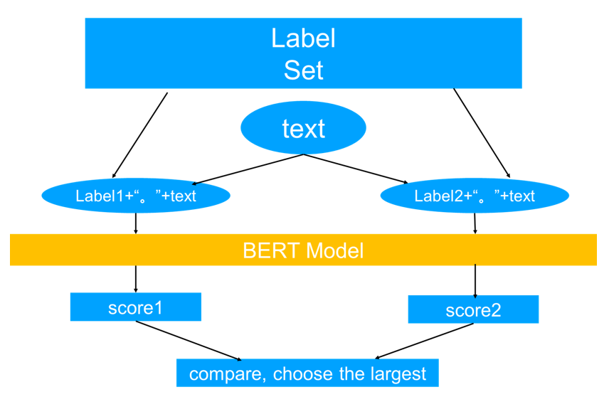
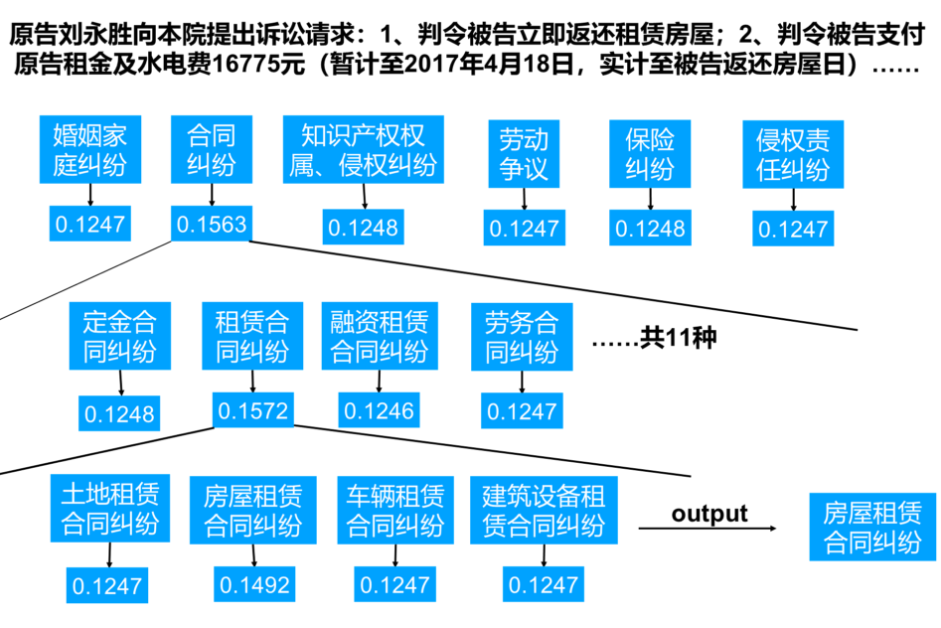

# NLP-project
This is a PyTorch/GPU implementation of the final project Hierarchical Multi-label Classification in Natural Language Processing and Deep Learning class. Feel free to contact guyuntian@stu.pku.edu.cn if you have any issues.

### Overview
1. Since the problem is hierarchical classification, it is not appropriate to simply do a softmax on all labels, ignoring the hierarchical relationship between labels. In this project, I adopt a simple procedure suited to the problem: predict the label one by one, from general label to specific label.
2. Instead of giving each classification task a classification head, I adopt a more efficient method: concatenate the label and the text, and let the model outputs a score to decide whether they are the same.
3. The max length of input text is 35092. However, I naively truncate them at max length 512, hopping the model can distinguish between classes after seeing the beginning.
4. I adopt post-pretraining to get "bert-base-chinese" familiar with datasets.

### Procedure of getting scores for labels



### Procedure of predicting



### Code Usage

* To separate validation set from training set, run the following code:

```
bash scripts/split.sh
```

* To pre-train , run the following code on GPU:

```
bash scripts/pretrain.sh
```

* To fine-tune, run the following code:

```
bash scripts/run.sh
```

* To get the threshold score for choosing which level of label the model predicts, run the following code:

```
bash scripts/threshold.sh
```

* Make sure to set the threshold in "scripts/predict.sh" to the best threshold you get. To get the final prediction, run the following code:

```
bash scripts/predict.sh
```


